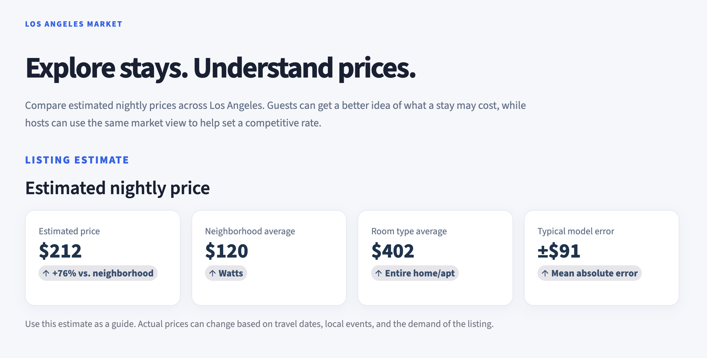
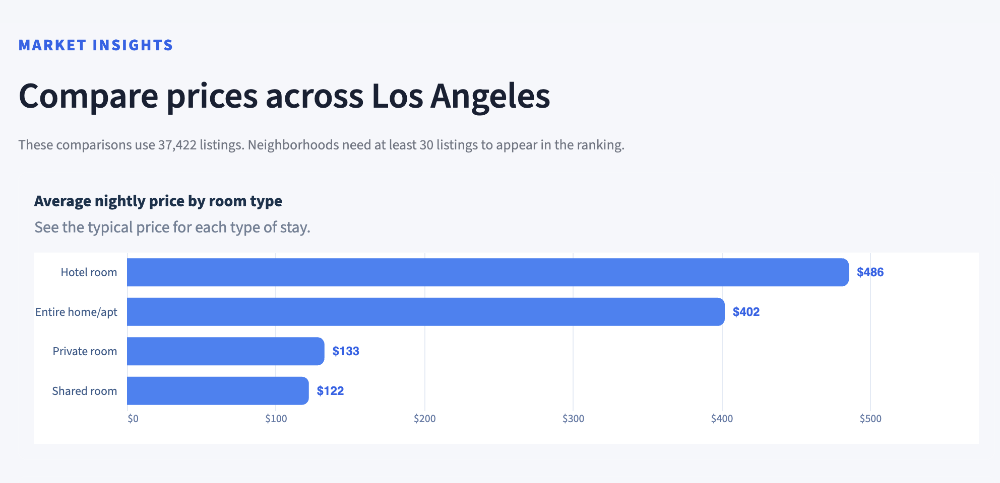
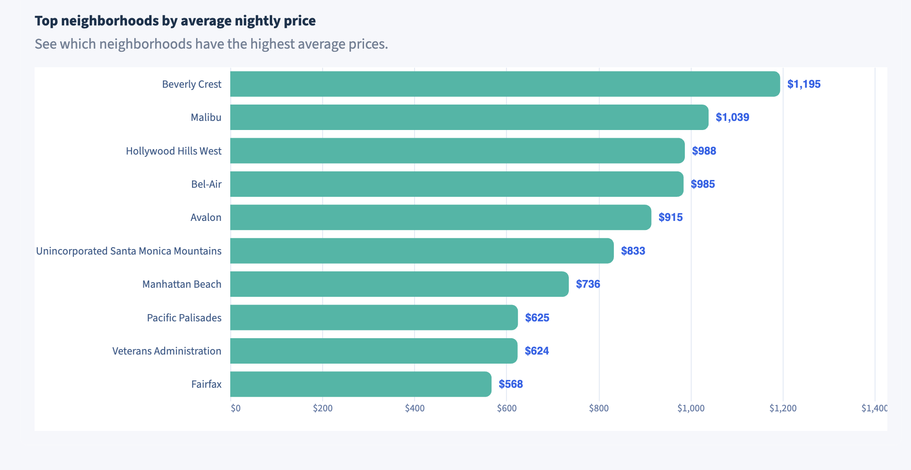
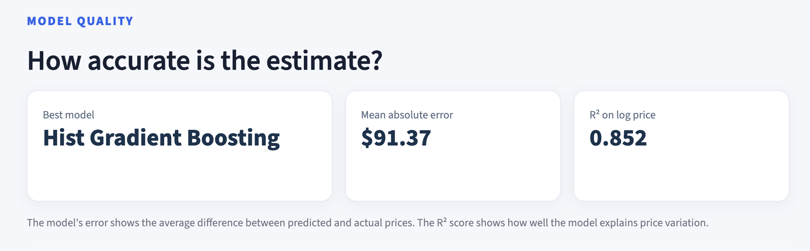
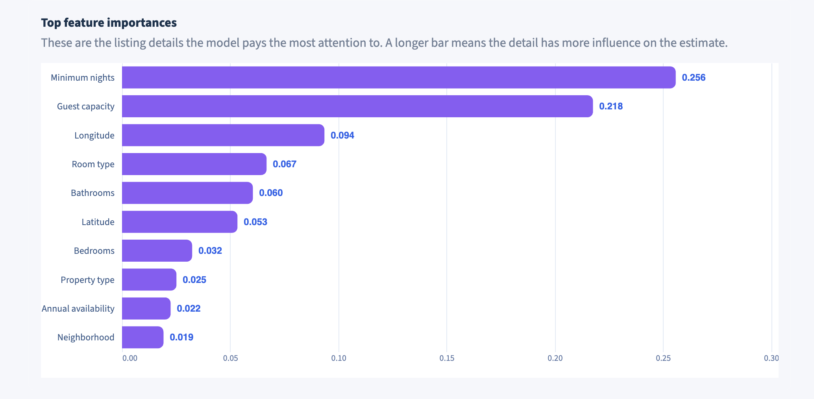
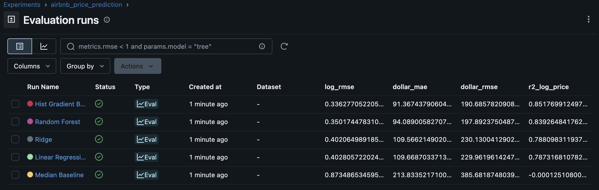

# Los Angeles Airbnb Price Predictor

This project is an end-to-end machine learning application that predicts Airbnb nightly prices in Los Angeles using listing details, location, reviews, availability, and property information

The final product is an interactive Streamlit dashboard where users can adjust listing details and view an estimated nightly price, market comparisons, model performance, and feature importance.

## Project Overview

Airbnb prices can vary widely depending on location, room type, property type, number of guests, amenities, reviews, and availability. The goal of this project was to build a machine learning pipeline that predicts nightly price and turns the results into a simple dashboard for market/user insights.

## Features

- Cleaned and prepared raw Airbnb listing data
- Engineered a log-price target for regression modeling
- Trained and compared multiple regression models
- Selected Hist Gradient Boosting as the best-performing model
- Built an interactive Streamlit dashboard
- Automatically estimates latitude and longitude from the selected neighborhood
- Shows market insights by room type and neighborhood
- Displays model quality metrics and feature importance
- Added a PySpark notebook for market analysis by booking type, neighborhood, and guest capacity
- Tracked model experiments with MLflow to compare metrics across regression models

## Dashboard Preview

### Price Prediction



### Market Insights




### Model Quality




## Dataset

The project uses Airbnb listing data for Los Angeles from Inside Airbnb. The raw dataset includes listing information such as price, location, property type, room type, reviews, availability, amenities, and host information.

The raw data is not included in this repository because of file size and reproducibility considerations.

## Modeling

The target variable was `log_price`, created using the nightly listing price. Predicting log price helped reduce the effect of extreme price outliers.

Models tested:

- Median baseline model
- Linear Regression
- Ridge Regression
- Random Forest Regressor
- Hist Gradient Boosting Regressor

The best model was Hist Gradient Boosting.

## Results

The best model achieved:

- Mean Absolute Error: about $91
- R² on log price: about 0.852

These results show that the model captures a meaningful amount of price variation, although exact Airbnb pricing can still depend on factors not fully captured in the dataset, such as listing photos, local events, and demand.

## MLflow Experiment Tracking

 MLflow experiment tracking is used to compare model runs, parameters, and evaluation metrics all in one place. 



## Tech Stack

- Python
- Pandas
- NumPy
- scikit-learn
- Streamlit
- Altair
- Matplotlib
- Joblib

## Repository Contents

- `notebooks/` — data cleaning, EDA, modeling, and dashboard prep notebooks
- `app/` — Streamlit dashboard code and dashboard metadata
- `reports/` — model results, feature importance, market summaries, and screenshots
- `models/` — saved machine learning model
- `requirements.txt` — Python dependencies

## How to Run Locally

Clone the repository:

```bash
git clone https://github.com/LucaLiVigni27/ml-project
cd ml-project
```

Install the required packages:

```bash
pip install -r requirments.txt
```

Run the Streamlist dashboard:

```bash
streamlit run app/streamlit_app.py
```

Then open the local URL shown in the terminal, usually:

```text
http://localhost:8501
```

## Future Improvements

- Add seasonal features, such as month, holidays, and major local events, to better capture changes in Airbnb demand.
- Include listing description text using NLP to capture details that are not represented in the structured data.
- Add a map-based view so users can explore predicted prices by neighborhood
- Deploy the Streamlit dashboard online so the project can be viewed without running it locally